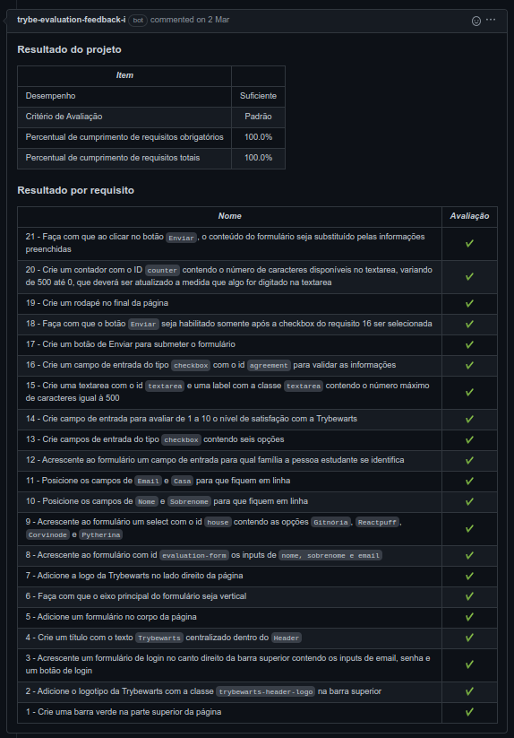
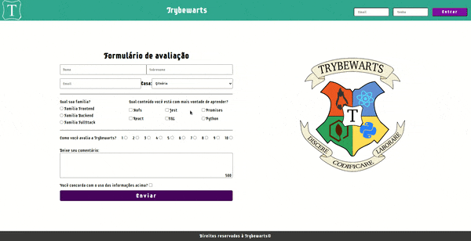

# Português 🇧🇷🇵🇹

  

    Saiba mais
  

  
  # TrybeWarts
Projeto da [Trybe](https://www.betrybe.com/) - Bloco 6 - Formulário construído com HTML, CSS Flexbox e JavaScript.

## 💻 Projeto

  
<strong>🏆 Meu desempenho</strong>
 

  

  

  
<strong>🖼️ Gif do projeto</strong>
 

  

## 🚀 Tecnologias
> Este projeto foi desenvolvido com:

- HTML
- CSS
- JavaScript

## 📌 Habilidades
> Habilidades desenvolvidas:

- Criar formulários em HTML;
- Capturar eventos e executar funções com JavaScript.
  
## Time de desenvolvimento
> Dupla:
  <table>
    <tr>
      <td>
        
        <h4 align="center">Alê Rabelo</h4>
      </td>
      <td>
        
        <h4 align="center">Davi Seles</h4>
      </td>
    </tr>
  </table>

## 💬 Contatos

   
   
   

# English 🇺🇸🇬🇧

  

    More
  

  
  # TrybeWarts
Project from [Trybe](https://www.betrybe.com/) - Block 6 - Forms build with HTML, CSS Flexbox and JavaScript.

## 💻 Project

  
<strong>🏆 My accomplishment</strong>
 

  

  

  
<strong>🖼️ Project's Gif</strong>
 

  

## 🚀 Technologies
> This project was developed with:

- HTML
- CSS
- JavaScript

## 📌 Skills
> Practiced skills:

- Create forms with HTML.
- Capture events and execute JavaScript functions. 
  
## Squad
> Pair
  <table>
    <tr>
      <td>
        
        <h4 align="center">Alê Rabelo</h4>
      </td>
      <td>
        
        <h4 align="center">Davi Seles</h4>
      </td>
    </tr>
  </table>

## 💬 Contact

   
   
   

# Deutsch 🇩🇪

  

    Mehr
  

  
  # TrybeWarts
Projekt von [Trybe](https://www.betrybe.com/) - Block 5 - Formular mit HTML, CSS Flexbox und JavaScript hergestellt.
  

## 💻 Projekt

  
<strong>🏆 Meine Leistung</strong>
 

  

  

  
<strong>🖼️ Projekts Gif</strong>
 

  

## 🚀 Technologies
> Dieses Projekt wurde mit den entsprechenden Technologies hergestellt:

- HTML
- CSS
- JavaScript

## 📌 Fähigkeiten
> Ausgeübte Fähigkeiten:

- Herstellung von HTML Formular;
- Ereignisse Erfassung und Funktionausführung.
  
## Entwickungsteam
> Paar:
  <table>
    <tr>
      <td>
        
        <h4 align="center">Alê Rabelo</h4>
      </td>
      <td>
        
        <h4 align="center">Davi Seles</h4>
      </td>
    </tr>
  </table>

## 💬 Kontakt

   
   
   

